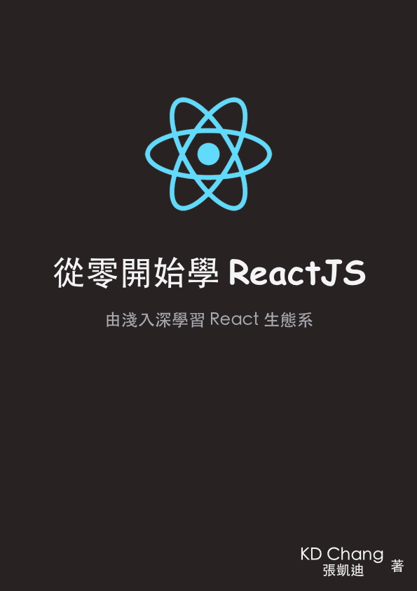

# 从零开始学 ReactJS（ReactJS 101）
一本给初学者的 React 中文入门教学书，由浅入深学习 ReactJS 生态系 (Flux, Redux, React Router, ImmutableJS, React Native, Relay/GraphQL etc.)，打造跨平台应用程序。

## 相关链接（Links）

1. [从零开始学 ReactJS（ReactJS 101）粉丝页](https://www.facebook.com/reactjs101/)

2. [繁体中文范例代码和书籍内容连载位置](https://github.com/kdchang/reactjs101)

3. [勘误、许愿、建议或提问](https://github.com/kdchang/reactjs101/issues)

## 翻译版本（Translate）

1. [简体中文版本 by @carlleton](https://github.com/carlleton/reactjs101/tree/zh-CN)
2. [前端圈简体中文版本 by @blueflylin]( https://github.com/blueflylin/reactjs101) [特别感谢前端圈小伙伴！](http://fequan.com/)

若需翻译成其他语言版本，请先 `fork` 一份 `repo` 到自己的 GitHub 并另外开新的 `branch`。最后将翻译版本链接更新在 `master` 分支中 `README.md` 的 `相关链接（Links）` 后发送 `Pull Request`，谢谢您。

## [目录（Table of Contents）](summary.html)

* [一、前端工程和 React 生态系（Ecosystem）简介](Ch01/README.md)
* [二、开发环境设置与 Webpack 入门](Ch02/README.md)
* [三、React/JSX/Component 简介](Ch03/README.md)
* [四、Props/State 基础与 Component 生命周期](Ch04/README.md)
* [五、React Router](Ch05/README.md)
* [六、ImmutableJS](Ch06/README.md)
* [七、Flux/Redux](Ch07/README.md)
* [八、Container 与 Presentational Components](Ch08/README.md)
* [九、实战教学：用 React + Router + Redux + ImmutableJS 写一个 Github 查询应用](Ch09/README.md)
* [十、实战教学：用 React + Redux + Node（Isomorphic JavaScript）开发食谱分享网站](Ch10/README.md)
* [附录一、React ES5、ES6+ 常见用法对照表](Appendix01/README.md)
* [附录二、用 React Native + Firebase 开发跨平台移动应用程序（Native Mobile App）](Appendix02/README.md)
* [附录三、React 测试入门教学](Appendix03/README.md)
* [附录四、GraphQL/Relay 初体验](Appendix04/README.md)

## 先备知识（Prior Knowledge）
本书针对已具备基本 HTML、CSS 和 JavaScript 和 DOM 操作知识的读者设计，但若读者对上述的技术仍不熟悉的话，建议可以先行参考：[MDN](https://developer.mozilla.org/zh-TW/)、[Codecademy](https://www.codecademy.com/)、[W3C School](http://www.w3schools.com/)、[JavaScript核心](http://weizhifeng.net/javascript-the-core.html) 或是参考笔者 [之前的教学讲义](http://kdchang.cc/web-programming-course/) 进行学习。另外，本书全书范例都将以 ES6+ 编写，若需参考 ES5 用法，请参考附录一的 [React ES5、ES6+ 常见用法对照表](./Appendix01)。

## 关于作者（Author）
[@kdchang](http://blog.kdchang.cc) 文艺型开发者，梦想是做出人们想用的产品和办一所心目中理想的学校，目前专注在 Mobile 和 IoT 应用开发。A Starter & Maker. JavaScript, Python & Arduino/Android lover.:)

## 版权许可（License）
本书采用创用CC授权4.0 "姓名标示─非商业性─相同方式分享(BY-NC-SA)" 授权。

本授权条款允许用户重制、散布、传输以及修改著作，但不得为商业目的之使用。若用户修改该著作时，仅得依本授权条款或与本授权条款类似者来散布该衍生作品。使用时必须按照著作人指定的方式表彰其姓名。

详细信息请参考 [CC BY-NC-SA 4.0](https://creativecommons.org/licenses/by-nc-sa/4.0/)。

## 关键字（Keywords）
React, React Native, React Router, Flux, Redux, Node, Express, ImmutableJS, NPM, Babel, Browserify, Webpack, Gulp, Grunt, Pure Functions, PropTypes, Stateless Functional Components, Presentational Components, ES6, ES5, JSX, Jest, Unit Test, Component, Relay, GraphQL, Universal/Isomorphic, React Tutorial React教程, React教学, 学React, React Tutorial, Tutorial, Ecosystem, Front-End
